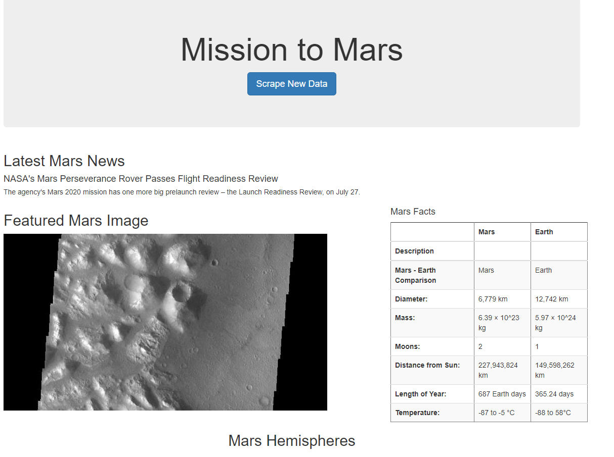

# Summary
Mission to Mars was a module that complied together the files to build a scraper for web sites for certain data, images, and web page information. Using a flask web page we were able to complete the module. We introduced new applications like Mongodb and Bootstrap in this challenge as well. 

* The visual below is the final output for the web app for challenge 10.

